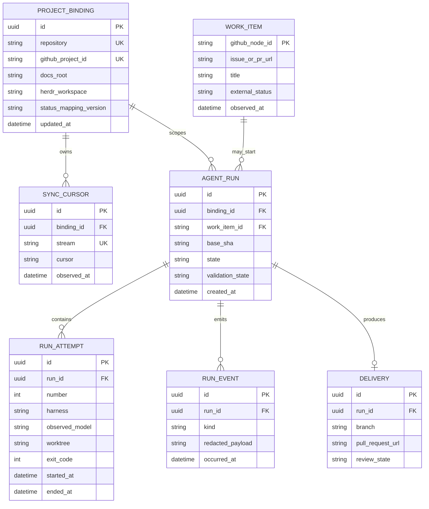
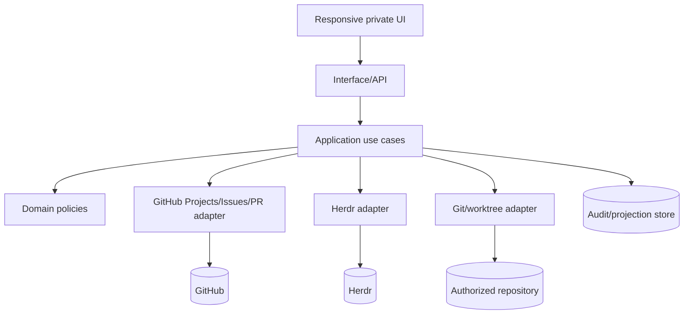
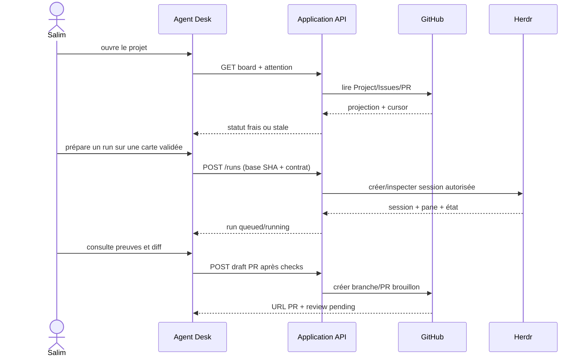

# Architecture specification — Noosphere Agent Desk V0

Statut : blueprint issu du reverse-architecture pass, 2026-09-19. Ce document ne prétend pas que les composants existent.

## 1. Produit et utilisateurs

Noosphere est une console privée pour un opérateur qui planifie des tâches de code, suit leur statut GitHub, consulte les documents du dépôt et supervise des runs d’agents hébergés par Herdr.

L’utilisateur doit pouvoir, en moins de cinq minutes : ouvrir un projet autorisé, comprendre ce qui demande son attention, inspecter une carte, lancer un run validé et voir une preuve exploitable quand il s’arrête.

## 2. Bounded contexts

| Context | Responsabilité | Autorité |
|---|---|---|
| Project binding | repo, Project ID, mapping, docs root, workspace Herdr | configuration versionnée + permission opérateur |
| Work tracking | cartes, statuts et liens Issues/PR | GitHub Projects v2 |
| Repository docs | lecture, édition, diff et PR | Git + GitHub |
| Agent runs | tickets, worktrees, sessions, tentatives, preuves | Agent Desk + Herdr pour l’exécution |
| Reconciliation | cursors, idempotency, stale/error state | projection locale auditable |

## 3. Domain model

Invariants: un run ne peut référencer qu’un `baseSha` résolu ; une tentative ne peut écrire que dans son worktree ; un `Delivery` ne peut publier qu’après checks et revue ; une mutation externe répétée ne crée pas de doublon.

## 4. Component blueprint

Use cases V0 : `ListProjectAttention`, `ReconcileProject`, `ReadDocument`, `ProposeDocumentChange`, `PrepareRun`, `StartRun`, `InspectRun`, `StopRun`, `PublishDraftPullRequest`.

## 5. API contract (proposed)

| Endpoint | Méthode | Résultat |
|---|---|---|
| `/api/projects` | GET | projets autorisés + fraîcheur + erreurs |
| `/api/projects/:id/reconcile` | POST | curseur et résumé idempotent de réconciliation |
| `/api/projects/:id/board` | GET/PATCH | projection GitHub et mutation de statut avec version observée |
| `/api/projects/:id/docs` | GET | index versionné sous `docs/` |
| `/api/projects/:id/docs/*path` | GET | document + SHA |
| `/api/projects/:id/doc-changes` | POST | branche/patch proposé, jamais écriture directe |
| `/api/runs` | POST | run préparé depuis ticket validé, état `queued` |
| `/api/runs/:id` | GET | état d’exécution et validation distincts |
| `/api/runs/:id/actions/start` | POST | démarrage autorisé, idempotency key |
| `/api/runs/:id/actions/stop` | POST | arrêt explicite et événement auditable |

Toutes les réponses d’intégration portent `freshness`, `source`, `observedAt` et une erreur actionnable quand la source est indisponible.

## 6. Critical journey

## 7. UX package

Les maquettes dans [`design/`](../../design/index.html) couvrent : tableau de bord/attention, Kanban GitHub, documents/diff et détail d’un run. Chaque écran contient empty/loading/error/success, est mobile-first à 390 px et utilise les mêmes tokens.

## 8. Validation et observabilité

Les tests unitaires couvrent mapping, idempotence, transitions d’état et permissions simulées. Les tests d’intégration utilisent GitHub/Herdr fake ou sandboxés. Les preuves d’un run incluent SHA, ticket, tentative, modèle observé, exit code, checks, diff et timestamps redigés. Aucun transcript privé ne part dans la PR.
