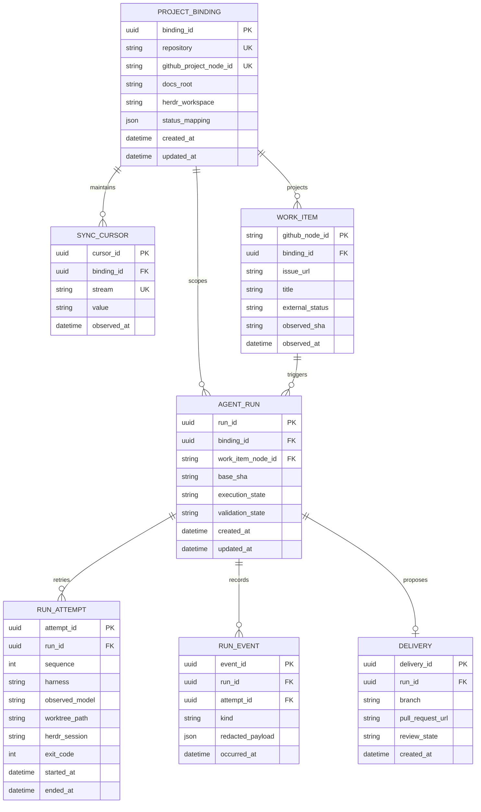
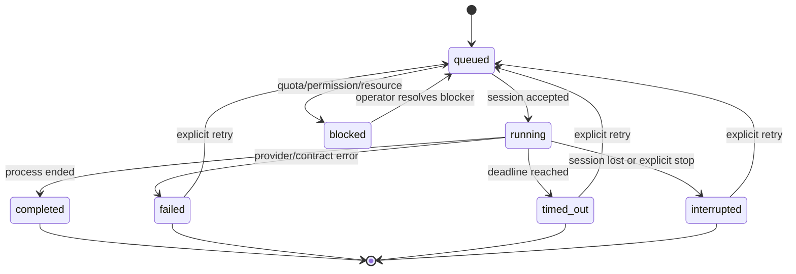
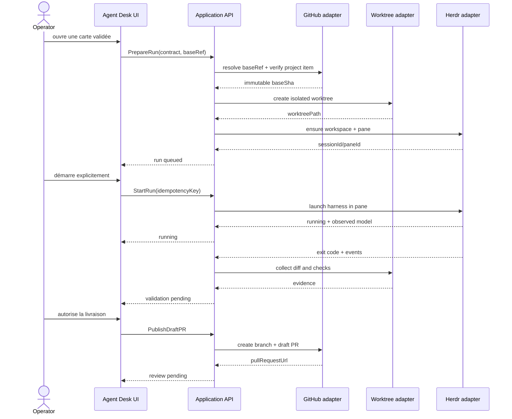
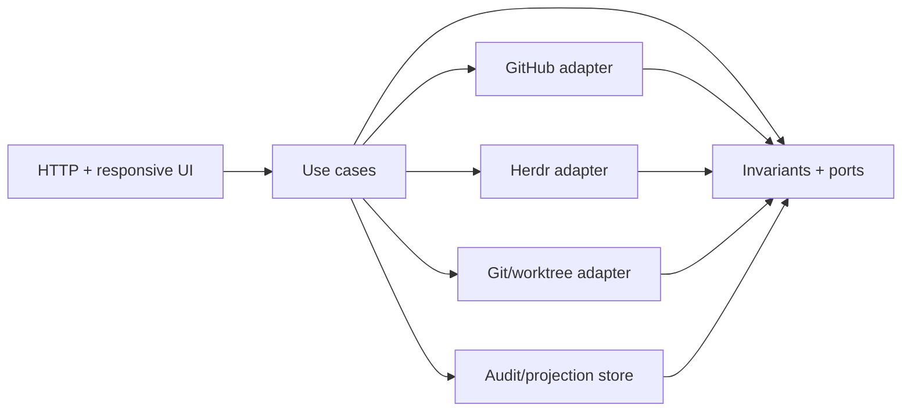

# UML et flux — Noosphere Agent Desk V0

Ces diagrammes décrivent le modèle cible proposé. Ils ne signifient pas que les tables ou services sont déjà implémentés.

## Entités et relations

## États d’un run

`validationState` est indépendant : `pending`, `passed`, `failed`, `not_run`. Un état `completed` ne change pas cette valeur automatiquement.

## Séquence carte → run → PR

## Dépendances et frontières

