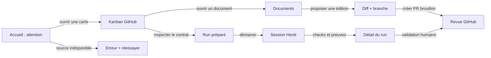

# UX specification — Agent Desk V0

Date : 2026-09-19 · Artefact : design statique, non production

## Décisions de cadrage

- **Utilisateur principal** : Salim, opérateur unique, au bureau sur macOS ou en mobilité sur smartphone.
- **État émotionnel** : il ouvre l’outil pour décider quoi faire, pas pour admirer des métriques. L’attention et les blocages passent avant les KPI.
- **Langue** : français dans les libellés et états ; les noms de branches, issues et commandes restent tels quels.
- **Accessibilité** : texte courant ≥ 16 px, contraste AA visé, actions au clavier, erreurs expliquées et récupérables.
- **Fraîcheur** : chaque donnée issue de GitHub ou Herdr affiche sa source et son âge ; stale et reconnecting sont des états normaux.

## Parcours critique

## Inventaire des écrans

| Écran | Route | Décision servie | États P0 | Action primaire |
|---|---|---|---|---|
| Accueil | `/projects/:id` | que dois-je traiter maintenant ? | vide, chargement, succès, erreur, stale | ouvrir l’élément urgent |
| Kanban | `/projects/:id/board` | quel statut GitHub dois-je modifier ? | vide, chargement, succès, conflit | déplacer/créer une carte |
| Documents | `/projects/:id/docs/*path` | quelle version de la décision est publiée ? | vide, chargement, succès, erreur, proposition | proposer une modification |
| Run | `/projects/:id/runs/:runId` | le worker a-t-il produit une preuve ? | queued, running, blocked, completed, failed, reconnecting | ouvrir/arrêter la session |

## Tokens de conception

Le bloc `:root` est identique dans les quatre écrans `design/screen-*.html`.

| Groupe | Choix | Usage |
|---|---|---|
| Surfaces | `surface-0` à `surface-3`, bordure `#304665` | profondeur par fonds et bordures, pas par ombres décoratives |
| Texte | primaire `#f4f7fb`, secondaire `#b8c5d8`, muted `#8091aa` | trois niveaux maximum |
| Accent | `#b7ee52` + premier plan sombre | actions primaires et sélection active uniquement |
| Sévérité | succès, avertissement, danger avec premier plan dédié | même vocabulaire dans badges, bannières et états |
| Typographie | système, mono pour SHA/commandes, 12/16/20/28 px | lecture mobile et preuves techniques |
| Espacement | 4, 8, 12, 16, 24, 32, 48 px | échelle unique |
| Rayon | 6, 10, pill 999 px | boutons/champs, panneaux, badges |

Le contraste du texte primaire sur `surface-0` est supérieur à 4,5:1 ; une passe automatisée WCAG reste à faire pendant l’implémentation.

## Revue à faire avant le code

1. Le chemin accueil → carte → run est-il compréhensible sans connaître Herdr ?
2. Sur 390 px, l’action principale reste-t-elle visible sans chercher dans un menu ?
3. Une donnée stale ou un conflit indique-t-il clairement ce qui est bloqué et pourquoi ?
4. Le diff contient-il assez de contexte pour approuver une PR sans ouvrir un terminal ?
