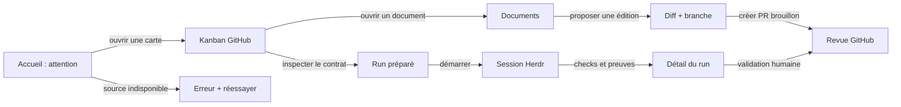

# UX specification — Agent Desk V0

Date : 2026-09-19 · Artefact : design statique, non production

## Décisions de cadrage

- **Utilisateur principal** : Salim, opérateur unique, au bureau sur macOS ou en mobilité sur smartphone.
- **État émotionnel** : il ouvre l’outil pour décider quoi faire, pas pour admirer des métriques. L’attention et les blocages passent avant les KPI.
- **Langue** : français dans les libellés et états ; les noms de branches, issues et commandes restent tels quels.
- **Accessibilité** : texte courant ≥ 16 px, contraste AA visé, actions au clavier, erreurs expliquées et récupérables.
- **Fraîcheur** : chaque donnée issue de GitHub ou Herdr affiche sa source et son âge ; stale et reconnecting sont des états normaux.

## Parcours critique

## Inventaire des écrans

| Écran | Route | Décision servie | États P0 | Action primaire |
|---|---|---|---|---|
| Accueil | `/projects/:id` | que dois-je traiter maintenant ? | vide, chargement, succès, erreur, stale | ouvrir l’élément urgent |
| Kanban | `/projects/:id/board` | quel statut GitHub dois-je modifier ? | vide, chargement, succès, conflit | déplacer/créer une carte |
| Documents | `/projects/:id/docs/*path` | quelle version de la décision est publiée ? | vide, chargement, succès, erreur, proposition | proposer une modification |
| Run | `/projects/:id/runs/:runId` | le worker a-t-il produit une preuve ? | queued, running, blocked, completed, failed, reconnecting | ouvrir/arrêter la session |

## Tokens de conception

Le bloc `:root` est identique dans les quatre écrans `design/screen-*.html`. La direction visuelle est une **grille éditoriale Swiss moderne** : surfaces claires, lignes fines, beaucoup d’air et un seul accent acide réservé aux actions. Elle évite les gradients, le glassmorphism et l’empilement de cartes.

| Groupe | Choix | Usage |
|---|---|---|
| Surfaces | `--bg: #f6f7f9`, `--surface: #fff`, `--surface-subtle: #eef1f5`, ligne `#dbe1e8` | hiérarchie par espaces et bordures, ombre seulement pour une priorité |
| Texte | encre `#10151c`, secondaire `#46515e`, muted `#75808d` | titres francs, aide lisible, métadonnées discrètes |
| Accent | `#365cff` + premier plan blanc | actions primaires, sélection active, signal de disponibilité |
| Sévérité | succès `#087a61`, avertissement `#9a6500`, danger `#c43f51` avec fonds dédiés | même vocabulaire dans badges, bannières et états |
| Typographie | système sans-serif, mono pour SHA/commandes, 11/13/16/21/30–54 px | densité maîtrisée et lecture mobile |
| Espacement | 4, 8, 12, 16, 24, 32, 48, 72 px | rythme unique et généreux |
| Rayon | 8, 14, pill 999 px | champs/actions, panneaux, statuts |

Les contrastes des textes courants sur les surfaces claires visent WCAG AA. Les boutons et liens gardent un focus visible ; les animations sont désactivées avec `prefers-reduced-motion`.

## Revue à faire avant le code

1. Le chemin accueil → carte → run est-il compréhensible sans connaître Herdr ?
2. Sur 390 px, l’action principale reste-t-elle visible sans chercher dans un menu ?
3. Une donnée stale ou un conflit indique-t-il clairement ce qui est bloqué et pourquoi ?
4. Le diff contient-il assez de contexte pour approuver une PR sans ouvrir un terminal ?
